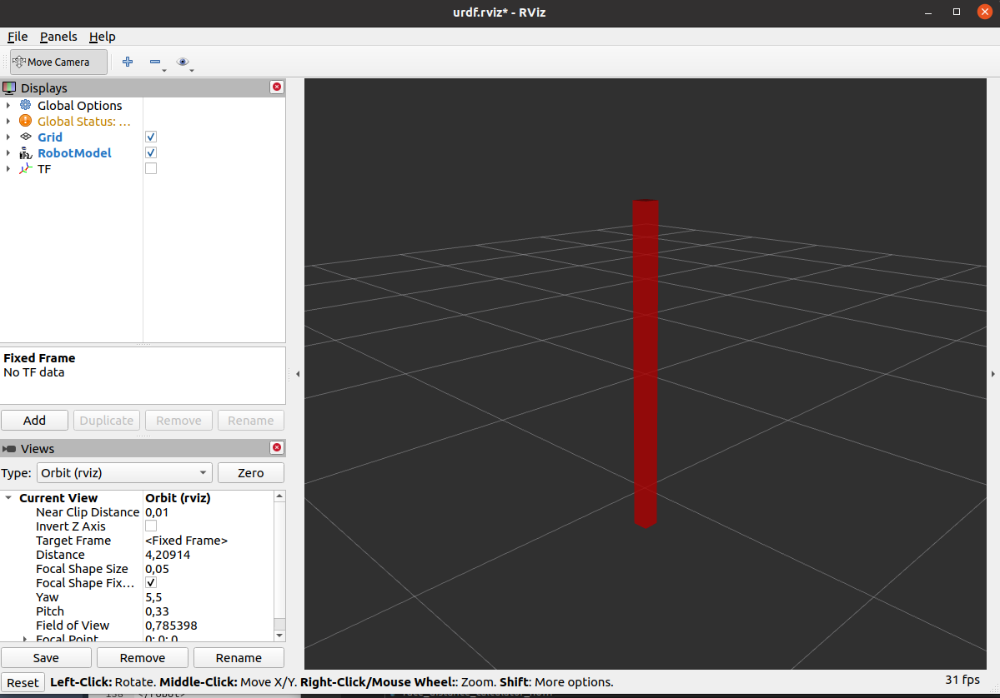
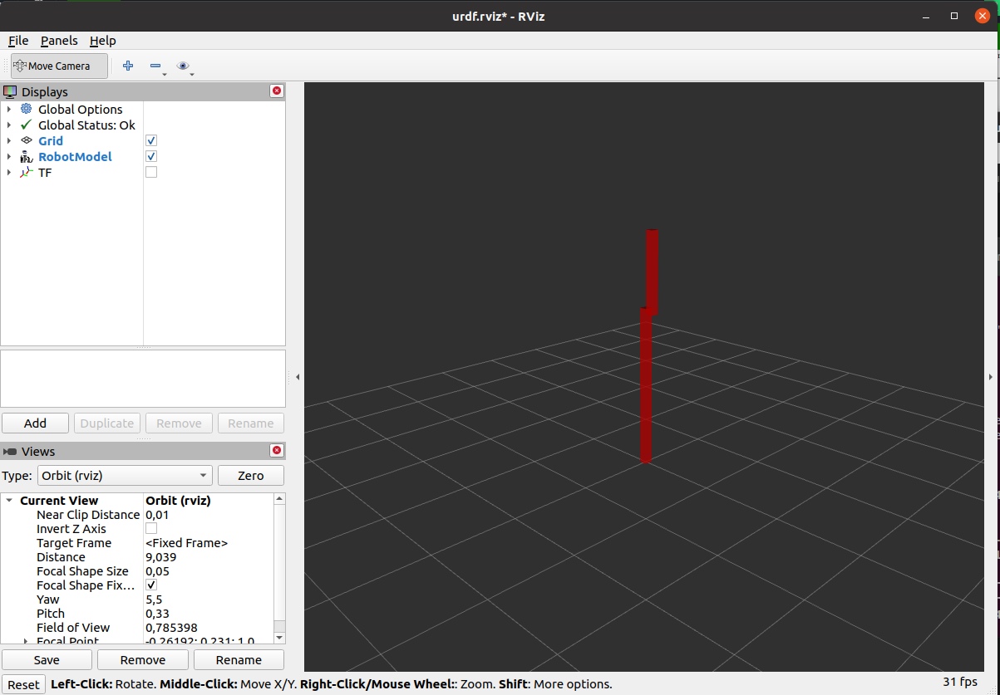
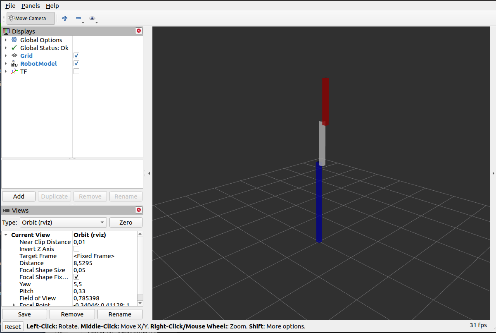

Lab2: URDF and xacro files
########

In this tutorial, we’re going to build a visual model of a double inverted pendulum robot called RRBot. You will learn how to articulate the model, add in some physical properties, generate neater code with xacro and make it move in Gazebo.

Before continuing, download the needed files from here:

:download:`zip <files/urdf_tutorial.zip>`

. Then create a new package using the knwon ``rosbash`` commands and insert the downloaded file in the rigth package`s folders.

One shape
======
First, we’re just going to explore one simple shape. Here’s about as simple as a urdf as you can make.

.. code-block:: xml

  <?xml version="1.0"?>
  <robot name="myfirst">
    <link name="base_link">
      <visual>
        <geometry>
          <box size="0.1 0.1 2"/>
        </geometry>
      </visual>
    </link>
  </robot>
  
To translate the XML into English, this is a robot with the name myfirst, that contains only one link, whose visual component is just a box of 0.1 m by 0.1 m and 2 m long.
To examine the model, launch the display.launch file: 

.. code-block::

  $ roslaunch urdf_tutorial display.launch model:='\$(find urdf_tutorial)/urdf/01-myfirst.urdf'

Your model is now displayed in rviz:

Multiple shapes
======

We will now add more than one shape.

.. code-block:: xml
  
  <?xml version="1.0"?>
  <robot name="multipleshapes">
    <link name="base_link">
      <visual>
        <origin xyz="0 0 1" rpy="0 0 0"/>
        <geometry>
          <box size="0.1 0.1 2"/>
        </geometry>
      </visual>
    </link>

    <link name="link2">
      <visual>
        <origin xyz="0 0 0.45" rpy="0 0 0"/>
        <geometry>
          <box size="0.1 0.1 1"/>
        </geometry>
      </visual>
    </link>

    <joint name="joint1" type="continuous">
      <parent link="base_link"/>
      <child link="link2"/>
      <origin xyz="0 0.1 1.95" rpy="0 0 0"/>
    </joint>

  </robot>
  
Here we defined origin of the ``base_link`` with ``<origin xyz="0 0 1" rpy="0 0 0"/>``
We also added a new **link2**. They are linked together as parent and child under the  **joint1** which is of type **"continuous"**. There are different types of joints that we will see later such as "fixed", "revolute", "prismatic". They define the type of junction between two links.
We can launch this new urdf with the following command:

.. code-block:: bash

  roslaunch urdf_tutorial display.launch model:='$(find urdf_tutorial)/urdf/02-multipleshapes.urdf'
  

You should have something like this in rviz:

Before moving on to the next section, let's add a final **link3** to our robot. The size is **0.1 0.1 1**, the origin for the link is **0 0 0.45** and for the **joint2** it's **0 0.1 0.90**.

Materials
=========

Now let's add some color to our robot:

.. code-block:: xml

  <?xml version="1.0"?>
  <robot name="materials">

    <material name="blue">
      <color rgba="0 0 0.8 1"/>
    </material>

    <material name="white">
      <color rgba="1 1 1 1"/>
    </material>

    <link name="base_link">
      <visual>
        <origin xyz="0 0 1" rpy="0 0 0"/>
        <geometry>
          <box size="0.1 0.1 2"/>
        </geometry>
        <material name="blue"/>
      </visual>
    </link>

    <joint name="joint1" type="continuous">
      <parent link="base_link"/>
      <child link="link2"/>
      <origin xyz="0 0.1 1.95" rpy="0 0 0"/>
      <axis xyz="0 1 0"/>
    </joint>

    <link name="link2">
      <visual>
        <origin xyz="0 0 0.45" rpy="0 0 0"/>
        <geometry>
          <box size="0.1 0.1 1"/>
        </geometry>
        <material name="white"/>
      </visual>
    </link>

    <joint name="joint2" type="continuous">
      <parent link="link2"/>
      <child link="link3"/>
      <origin xyz="0 0.1 0.90" rpy="0 0 0"/>
      <axis xyz="0 1 0"/>
    </joint>

      <link name="link3">
      <visual>
        <origin xyz="0 0 0.45" rpy="0 0 0"/>
        <geometry>
          <box size="0.1 0.1 1"/>
        </geometry>
        <material name="blue"/>
      </visual>
    </link>

  </robot>
  

The new colors are declared first with:

.. code-block:: xml

  <material name="blue">
    <color rgba="0 0 0.8 1"/>
  </material>
We can then use them with the name given, here it's "blue". In this new urdf we added also ``<axis xyz="0 1 0"/>`` for the **joint1** and the **joint3** this is the axis along which the links are rotating. You can change it to ``<axus xyz="1 0 0"/>`` to see what happens.
You can display the urdf with:

.. code-block::

  roslaunch urdf_tutorial display.launch model:='$(find urdf_tutorial)/urdf/03-materials.urdf'

  
Physical Properties
========

Collision
********

So far, we've only specified our links  a single sub-element, visual, which defines (not surprisingly) what the robot looks like. However, in order to get collision detection to work or to simulate the robot in something like Gazebo, we need to define a collision element as well.
Here is the code for our new base link.

.. code-block:: xml

    <link name="base_link">
    <visual>
      <origin xyz="0 0 1" rpy="0 0 0"/>
      <geometry>
        <box size="0.1 0.1 2"/>
      </geometry>
      <material name="blue"/>
    </visual>

    <collision>
      <origin xyz="0 0 1" rpy="0 0 0"/>
      <geometry>
	      <box size="0.1 0.1 2"/>
      </geometry>
    </collision>  
  </link>
  

* The collision element is a direct subelement of the link object, at the same level as the visual tag.
* The collision element defines its shape the same way the visual element does, with a geometry tag. The format for the geometry tag is exactly the same here as with the visual.
* You can also specify an origin in the same way as a subelement of the collision tag (as with the visual).

In many cases, you’ll want the collision geometry and origin to be exactly the same as the visual geometry and origin.

.. note::
  Now it's your turn, add the collision for **link2** and **link3**.
  

Inetria
******
In order to get your model to simulate properly, you need to define several physical properties of your robot, i.e. the properties that a physics engine like Gazebo would need. 

Your urdf should now look like this:

.. code-block:: xml

  <?xml version="1.0"?>
  <robot name="collision">

    <material name="blue">
      <color rgba="0 0 0.8 1"/>
    </material>

    <material name="white">
      <color rgba="1 1 1 1"/>
    </material>

    <link name="base_link">
      <visual>
        <origin xyz="0 0 1" rpy="0 0 0"/>
        <geometry>
          <box size="0.1 0.1 2"/>
        </geometry>
        <material name="blue"/>
      </visual>

      <collision>
        <origin xyz="0 0 1" rpy="0 0 0"/>
        <geometry>
          <box size="0.1 0.1 2"/>
        </geometry>
      </collision>  

      <inertial>
        <origin xyz="0 0 0.5" rpy="0 0 0"/>
        <mass value="1"/>
        <inertia ixx="0.33" ixy="0.0" ixz="0.0" iyy="0.33" iyz="0.0" izz="0.001"/>
      </inertial>
    </link>

    <joint name="joint1" type="continuous">
      <parent link="base_link"/>
      <child link="link2"/>
      <origin xyz="0 0.1 1.95" rpy="0 0 0"/>
      <axis xyz="0 1 0"/>
    </joint>

    <link name="link2">
      <visual>
        <origin xyz="0 0 0.45" rpy="0 0 0"/>
        <geometry>
          <box size="0.1 0.1 1"/>
        </geometry>
        <material name="white"/>
      </visual>

      <collision>
        <origin xyz="0 0 0.45" rpy="0 0 0"/>
        <geometry>
          <box size="0.1 0.1 1"/>
        </geometry>
      </collision>

      <inertial>
        <origin xyz="0 0 0.5" rpy="0 0 0"/>
        <mass value="1"/>
        <inertia ixx="0.08" ixy="0.0" ixz="0.0" iyy="0.08" iyz="0.0" izz="0.001"/>
      </inertial>
    </link>

    <joint name="joint2" type="continuous">
      <parent link="link2"/>
      <child link="link3"/>
      <origin xyz="0 0.1 0.90" rpy="0 0 0"/>
      <axis xyz="0 1 0"/>
    </joint>

      <link name="link3">
      <visual>
        <origin xyz="0 0 0.45" rpy="0 0 0"/>
        <geometry>
          <box size="0.1 0.1 1"/>
        </geometry>
        <material name="blue"/>
      </visual>

      <collision>
        <origin xyz="0 0 0.45" rpy="0 0 0"/>
        <geometry>
          <box size="0.1 0.1 1"/>
        </geometry>
      </collision>

      <inertial>
        <origin xyz="0 0 0.5" rpy="0 0 0"/>
        <mass value="1"/>
        <inertia ixx="0.08" ixy="0.0" ixz="0.0" iyy="0.08" iyz="0.0" izz="0.001"/>
      </inertial>
    </link>

  </robot>

* This element is also a subelement of the link object
* The mass is defined in kilograms.
* The 3x3 rotational inertia matrix is specified with the inertia element. Since this is symmetrical, it can be represented by only 6 elements.

Using xacro
********

In this section, we take a look at all the shortcuts to help reduce the overall size of the URDF file and make it easier to read and maintain. For that we are going to use the xacro. As its name implies, xacro is a macro language for XML. The xacro program runs all of the macros and outputs the result. Typical usage looks something like this: 

.. code-block::
  
  $  xacro --inorder model.xacro > model.urdf
  

It does three things that are very helpful.
* Constants.
* Simple Math.
* Macros.

At the top of the URDF file, you must specify a namespace in order for the file to parse properly. For example, these are the first two lines of a valid xacro file: 

.. code-block::

  <?xml version="1.0"?>
  <robot xmlns:xacro="http://www.ros.org/wiki/xacro" name="firefighter">
  
Constants
*****

Let's take a quick look at our **base_link**:

.. code-block::
  
  <link name="base_link">
    <visual>
      <origin xyz="0 0 1" rpy="0 0 0"/>
      <geometry>
        <box size="0.1 0.1 2"/>
      </geometry>
      <material name="blue"/>
    </visual>

    <collision>
      <origin xyz="0 0 1" rpy="0 0 0"/>
      <geometry>
        <box size="0.1 0.1 2"/>
      </geometry>
    </collision>  

    <inertial>
      <origin xyz="0 0 0.5" rpy="0 0 0"/>
      <mass value="1"/>
      <inertia ixx="0.33" ixy="0.0" ixz="0.0" iyy="0.33" iyz="0.0" izz="0.001"/>
    </inertial>
  </link>

We can see that some information are getting repeated, the width and the height of our links for example. We can use a xacro to pass them as a constant parameter. 

